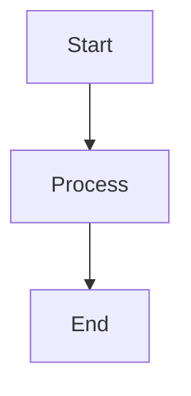

# Hugo Technical Blog

A modern technical blog built with Hugo static site generator, featuring the PaperMod theme with Monokai syntax highlighting for optimal code readability.

## Features

- **Fast Static Site**: Built with Hugo for lightning-fast page loads
- **Technical Content Optimized**: Monokai syntax highlighting for code blocks
- **Responsive Design**: Mobile-friendly PaperMod theme
- **Mathematical Expressions**: Support for LaTeX math rendering
- **Search Functionality**: Built-in search capabilities
- **SEO Optimized**: Meta tags and structured data for better search visibility
- **Automated Deployment**: GitHub Actions CI/CD pipeline

## Quick Start

### Prerequisites

- [Hugo Extended](https://gohugo.io/installation/) (v0.112.0 or later)
- [Git](https://git-scm.com/)
- [Node.js](https://nodejs.org/) (for theme development, optional)

### Local Development

1. **Clone the repository**:
   ```bash
   git clone <your-repo-url>
   cd hugo-technical-blog
   ```

2. **Initialize submodules** (for the theme):
   ```bash
   git submodule update --init --recursive
   ```

3. **Start the development server**:
   ```bash
   hugo server -D
   ```

4. **Open your browser** and navigate to `http://localhost:1313`

### Creating New Posts

1. **Generate a new post**:
   ```bash
   hugo new posts/your-post-title.md
   ```

2. **Edit the post** in `content/posts/your-post-title.md`

3. **Set `draft: false`** in the front matter when ready to publish

4. **Preview locally** with `hugo server -D`

## Project Structure

```
├── .github/
│   └── workflows/          # GitHub Actions workflows
├── archetypes/             # Content templates
├── assets/                 # Custom CSS and assets
├── content/                # Blog content
│   ├── posts/             # Blog posts
│   ├── about.md           # About page
│   └── search.md          # Search page
├── layouts/               # Custom layout overrides
├── static/                # Static files (images, etc.)
├── themes/PaperMod/       # Theme submodule
├── config.yml             # Hugo configuration
└── README.md              # This file
```

## Configuration

### Site Configuration

Edit `config.yml` to customize:
- Site title, description, and author
- Social media links
- Menu structure
- Theme parameters
- Syntax highlighting settings

### Theme Customization

- **Custom CSS**: Add styles to `assets/css/extended/`
- **Layout Overrides**: Create files in `layouts/` to override theme templates
- **Shortcodes**: Add custom shortcodes in `layouts/shortcodes/`

## Content Guidelines

### Front Matter

Each post should include proper front matter:

```yaml
---
title: "Your Post Title"
date: 2024-01-01T00:00:00Z
draft: false
tags: ["tag1", "tag2"]
categories: ["category"]
description: "SEO-friendly description"
---
```

### Code Blocks

Use fenced code blocks with language specification for syntax highlighting:

````markdown
```python
def hello_world():
    print("Hello, World!")
```
````

### Mathematical Expressions

Use LaTeX syntax for mathematical expressions:

```markdown
Inline math: $E = mc^2$

Block math:
$$
\int_{-\infty}^{\infty} e^{-x^2} dx = \sqrt{\pi}
$$
```

### Diagrams

Use Mermaid for diagrams:

````markdown

````

## Deployment

### GitHub Pages

This blog is configured for automatic deployment to GitHub Pages via GitHub Actions.

1. **Enable GitHub Pages** in repository settings
2. **Set source** to "GitHub Actions"
3. **Push to main branch** triggers automatic deployment

### Manual Deployment

To build and deploy manually:

```bash
# Build the site
hugo --minify

# Deploy the public/ directory to your hosting provider
```

## Contributing

### Writing Guidelines

1. **Technical Accuracy**: Ensure all code examples are tested and working
2. **Clear Structure**: Use proper headings and organize content logically
3. **Code Quality**: Follow language-specific best practices in examples
4. **SEO Optimization**: Include relevant tags, categories, and descriptions

### Submission Process

1. **Fork the repository**
2. **Create a feature branch**: `git checkout -b feature/new-post`
3. **Write your post** following the content guidelines
4. **Test locally**: `hugo server -D`
5. **Submit a pull request** with a clear description

### Code Style

- Use meaningful commit messages
- Follow the existing project structure
- Test all code examples before submission
- Optimize images and assets for web

## Troubleshooting

### Common Issues

**Hugo server not starting**:
- Ensure Hugo Extended is installed
- Check for syntax errors in config.yml
- Verify theme submodule is initialized

**Theme not loading**:
```bash
git submodule update --init --recursive
```

**Build failures**:
- Check Hugo version compatibility
- Validate front matter syntax
- Ensure all referenced files exist

**Syntax highlighting not working**:
- Verify language specification in code blocks
- Check Chroma configuration in config.yml

### Getting Help

- [Hugo Documentation](https://gohugo.io/documentation/)
- [PaperMod Theme Documentation](https://github.com/adityatelange/hugo-PaperMod)
- [GitHub Issues](../../issues) for bug reports and feature requests

## License

This project is licensed under the MIT License - see the [LICENSE](LICENSE) file for details.

## Acknowledgments

- [Hugo](https://gohugo.io/) - The world's fastest framework for building websites
- [PaperMod](https://github.com/adityatelange/hugo-PaperMod) - A fast, clean, responsive Hugo theme
- [Chroma](https://github.com/alecthomas/chroma) - A general purpose syntax highlighter